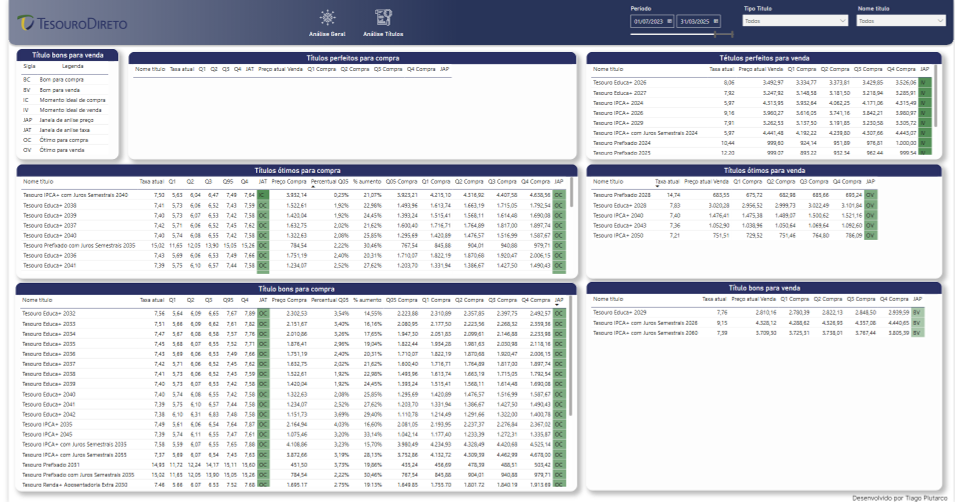

# Mark-to-Market Analysis of Brazilian Government Bonds 📈

This project analyzes the historical behavior of Brazilian Treasury bonds through a mark-to-market approach. The objective is to identify appreciation and depreciation cycles using statistical quartiles. The pipeline was developed in Python (Google Colab), with a final dashboard built in Power BI.

## 📊 Dashboard Preview

### General Overview Page

### Detailed Bond Analysis Page

## 📌 Objective
To identify cycles of price increase and decrease in government bonds based on historical market data and statistical analysis — providing visual and strategic support for investors and researchers.

## 🔧 Technologies Used
- Python (Google Colab)
- Pandas
- Web Scraping (BeautifulSoup)
- Google Sheets API
- Power BI (final dashboard)

## 🧱 Project Structure
1. **Data Collection**: Web scraping from the Brazilian Treasury website  
2. **ETL and Cleaning**: Data normalization and transformation, including outlier handling and quartile classification  
3. **Export Automation**: Processed data exported to Google Sheets  
4. **Visualization**: Dashboard created in Power BI with filters and historical trend analysis

## 🚀 How to Run
1. Open `ETL_Treasury_Market_Analysis_EN.ipynb` in Google Colab  
2. Install required libraries (`pip install wget`, `bs4`, etc.)  
3. Authenticate Google account to access Google Drive  
4. Execute all cells in order  
5. Use the generated Google Sheets as a data source in Power BI

## 📁 Data Source
Data is collected from the [official Brazilian Treasury website](https://www.tesourodireto.com.br/). Before running the scraping process, check that the structure of the site has not changed.

---

**Author:** Tiago Plutarco  
**Contact:** [LinkedIn](https://www.linkedin.com/in/tiagoplutarco)
